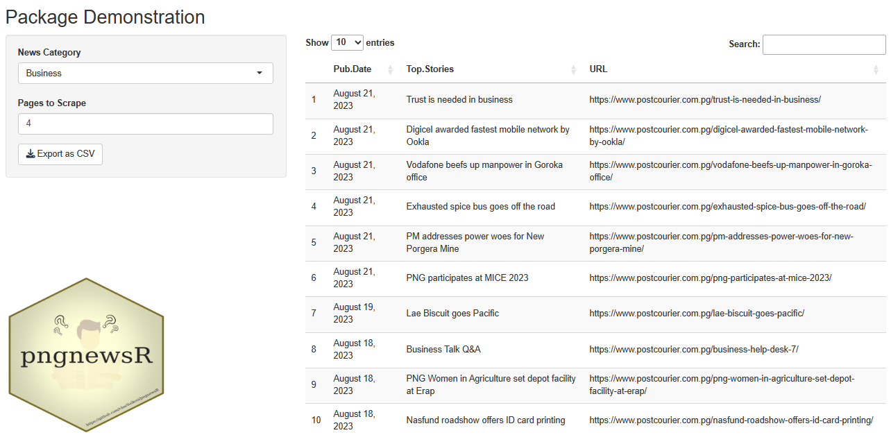

# pngnewsR 

[](https://choosealicense.com/licenses/mit/)
[]()
[](https://github.com/charlieikosi/pngnewsR/)
[](https://www.repostatus.org/#active)

### Introduction

The `pngnewsR`is an open-source webscraper package that scrapes the Post-Courier news website which is a Papua New Guinean newspaper for news articles. Its expectation is that the data derived from the packages functions provide the first steps of data collection towards news sentiment analysis. `pngnewsR` does this in such a way that its outputs are in tabular form and can further be worked on by other R package functions.

#### Installation

To be able to use this package, you will need to first install [R and RStudio](https://posit.co/download/rstudio-desktop/) into your machine.

Once that has downloaded and installed, run the following script below:

```
library(devtools) 
install_github("charlieikosi/pngnewsR")
```
#### Load Package
Load the package using the script:
```
library(pngnewsR)
```
This allows you to utilize several of `pngnewsR`'s webscraping functions. These functions are named against the category of news articles hosted on the Post-Courier news website to make things simple. You can visit [this link](https://www.postcourier.com.pg/) to understand what sections of the website the functions are scraping.

##### Available Functions
- `business()` scrapes only business news articles
- `feature()` scrapes only featured news articles
- `topstories()` scrapes only top story news articles
- `world()` scrapes only world news articles
- `sport()` scrapes only sport news articles
- `scrape_news()` scraper function that can be used to call other functions listed above.

##### Usage
All functions except the `scrape_news()` take only one arguement, `pages` which must be an integer. 

`scrape_news()` takes two arguments i.e. `pages` and `news`. The `news` argument takes in a character string and must be either `"business", "sport", "world", "national", "topstories" or "feature"`.
##### Examples
```
business_df <- business(page=1)
topstories_df <- topstories(1)
num <- 1
sport_df <- sport(num)
topstories_df2 <- scrape_news(page=2,news="topstories")
```
##### Outputs
`pngnewsR` functions endeavour to structure all scrapped data into tabular form as a tibble. Three columns make up the tabular data:
- Pub.Date - date of publication
- Top.Stories - title of news articles
-  URL - article url from which it was scrapped

```
# A tibble: 10 × 3
   Pub.Date        Top.Stories                                        URL                             
   <chr>           <chr>                                              <chr>                           
 1 August 21, 2023 Garap: Kerevat jail needs urgent govt intervention https://www.postcourier.com.pg/…
 2 August 21, 2023 OSICA calls to support locally produced rice       https://www.postcourier.com.pg/…
 3 August 21, 2023 Bands sign contract with Big Records               https://www.postcourier.com.pg/…
 4 August 21, 2023 Danny’s Travel – My Experience with Traffic in POM https://www.postcourier.com.pg/…
 5 August 18, 2023 Chasing My Dream                                   https://www.postcourier.com.pg/…
 6 August 18, 2023 Bilum sales add extra income to a Mum              https://www.postcourier.com.pg/…
 7 August 18, 2023 UPNG Geology Student helped develop his community  https://www.postcourier.com.pg/…
 8 August 18, 2023 Cleaner by day, taxi driver at night               https://www.postcourier.com.pg/…
 9 August 18, 2023 Perfect taxi condition for my customers’ safety    https://www.postcourier.com.pg/…
10 August 18, 2023 Frangipani Festival set                            https://www.postcourier.com.pg/…
> 
```
#### Demonstration
To demonstrate the pngnewsR package functions, we have created a basic [rshiny app](https://niuginitravelor.shinyapps.io/pngnewsRApp/) that will enable non-coders to work on the front-end which is user friendly. We've also included an added option to download the scraped data as a .csv




